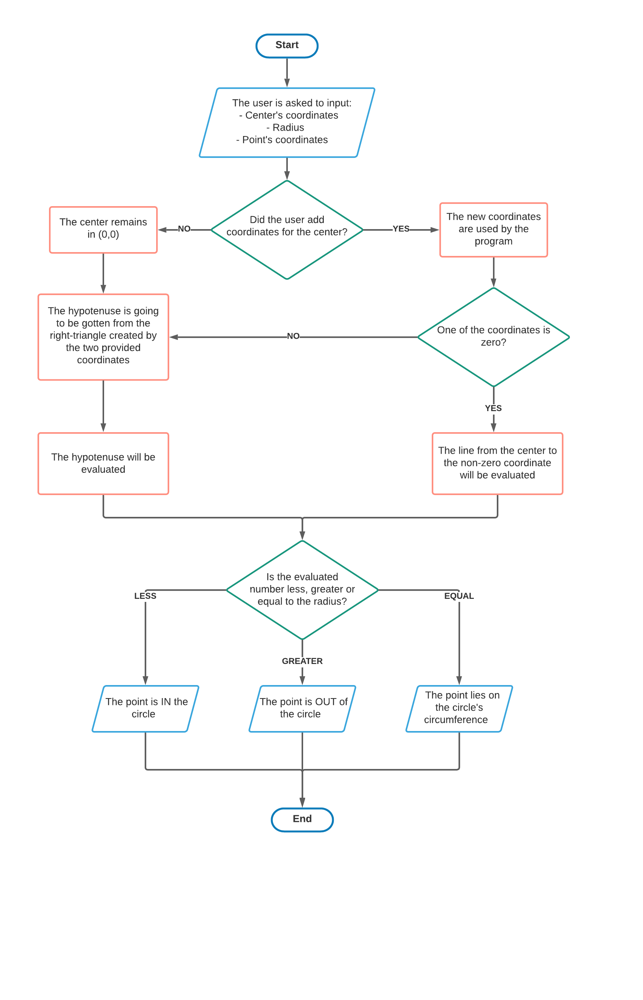

# DotInACircle
Given the radius and the coordinates of a dot, the program needs to be able to determine wheter the dot is IN, OUT or ON the circle.
The default value of the center will be (0,0) but the user can change it if he wants.

## Flowchart
